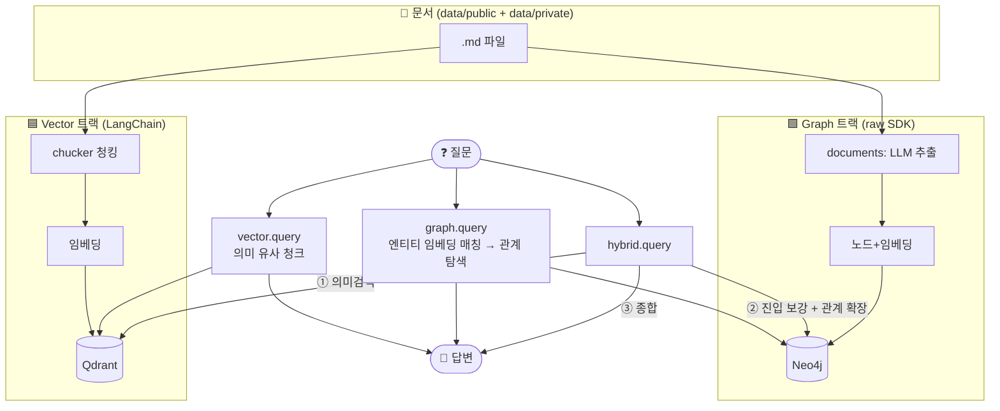

<div align="center">

# 🔍 RAG Repository

**Confluence 문서 기반 지식 질의응답 PoC — Vector · Graph · Hybrid RAG를 한 저장소에서 비교**


</div>

---

## 📑 목차

- [소개](#-소개)
- [추가 구현](#-추가-구현)
- [세 가지 RAG 한눈에 비교](#-세-가지-rag-한눈에-비교)
- [아키텍처](#-아키텍처)
- [빠른 시작](#-빠른-시작)
- [사용법](#-사용법)
- [프로젝트 구조](#-프로젝트-구조)
- [동작 원리](#-동작-원리)
- [데이터 관리 (공개/비공개)](#-데이터-관리-공개비공개)
- [로드맵 (다음 작업)](#-로드맵-다음-작업)
- [알려진 한계 · 보완점](#-알려진-한계--보완점)
- [주의점](#-주의점)

---

## 🎯 소개

같은 Confluence 문서를 **세 가지 RAG 방식으로 각각 구현**해, 무엇을 언제 써야 하는지 눈으로 비교하는 학습·검증용 PoC입니다.

| 방식 | 검색 원리 | 저장소 | 한 줄 요약 |
| --- | --- | --- | --- |
| **Vector RAG** | 의미 유사도 | Qdrant | 문서 어디에 답이 있나 |
| **Graph RAG** | Entity 관계 탐색 | Neo4j | 개념들이 어떻게 이어지나 |
| **Hybrid RAG** | Vector→Graph 순차 | Qdrant + Neo4j | 벡터로 진입점 찾고 그래프로 관계 확장 |

> **설계 의도**: `vector/`는 LangChain 추상화로, `graph/`는 raw SDK(neo4j·google-genai)로 구현해 **"프레임워크가 무엇을 대신해 주는가"** 를 대조합니다. `hybrid/`는 두 트랙을 재사용해 결합합니다.

---

## ✨ 추가 구현

3트랙 위에 **실데이터를 안전·검증 가능하게** 다루는 층을 더했습니다.

| 기능 | 설명 |
| --- | --- |
| 🔒 **민감정보 마스킹** (`preprocessing/masking.py`) | 적재 시점에 email·전화·IP·비밀번호·토큰·DB 자격증명을 결정론 정규식으로 치환 → 원문이 벡터DB·그래프·외부 LLM으로 나가지 않음 (다중 방어: 문서 선택 제외 → 마스킹 → gitignore) |
| 🧩 **약어/동의어 정규화** (`preprocessing/aliases.py`) | `k8s=Kubernetes`처럼 표기를 통일해 그래프 노드 분산 방지. 공통용어(public)+도메인약어(private) 분리, 반자동 후보탐지 + 사람 검토 |
| 📊 **평가 하네스** (`evaluation/`) | 골든셋 + 순수 채점(source/entity recall·근거·환각). 데이터셋·채점은 무외부호출·결정론 → 데이터/코드 변경 시 회귀 비교 |
| 🖥 **통합 웹 + 그래프 탐색** (`web_app.py`) | 3트랙을 탭 하나로 통합(`:8000`), Neo4j 지식그래프를 vis-network로 인터랙티브 시각화하는 탐색 탭 |
| ⚡ **배치 임베딩** (`graph/embedding.py`) | 노드 임베딩을 배치 호출 + 429 재시도로 무료 티어 rate limit 회피 |

> 프로젝트 개요·설계 결정·문제 해결 사례 정리 → **[PORTFOLIO.md](PORTFOLIO.md)**

---

## ⚖️ 세 가지 RAG 한눈에 비교

| | ✅ 강한 질문 | ⚠️ 약한 질문 |
| --- | --- | --- |
| **Vector** | 의미가 비슷한 문서 검색, 표현이 달라도(동의어·의역) 잘 찾음 | 여러 Entity를 관계로 이어 추론해야 하는 질문 |
| **Graph** | 원인→조치 경로, A와 B의 관계, 담당자 추적 | 그래프에 없는 주제, 진입 Entity가 불명확한 질문 |
| **Hybrid** | **표현이 문서와 다르면서(vector 보강) 관계 추론이 필요한 질문** | 두 소스 모두 무관한 질문, 요청당 LLM 호출이 많아 쿼터에 취약 |

각 웹 UI에는 위 특성에 맞는 **좋은/나쁜 예시 질문**이 버튼으로 제공됩니다(클릭 시 자동 입력).

---

## 🏗 아키텍처



---

## 🚀 빠른 시작

### 1. 요구사항

- Python 3.14, `.venv`
- **컨테이너 런타임: Podman** (Neo4j, Qdrant를 직접 기동)
- Google Gemini API Key (임베딩 + 생성)

### 2. 설치

```bash
python -m venv .venv
.venv/bin/pip install -r requirements.txt
cp .env.example .env      # 값 채우기 (아래 참고)
```

### 3. 환경변수 (`.env`)

| 변수 | 설명 | 예시 |
| --- | --- | --- |
| `CONFLUENCE_WIKI_URL` `CONFLUENCE_USER_EMAIL` `CONFLUENCE_ACCESS_TOKEN` | Confluence 수집용 | — |
| `EMBEDDING_API_KEY` / `EMBEDDING_API_MODEL` | 임베딩 | `gemini-embedding-001` (3072차원) |
| `LLM_API_KEY` / `LLM_API_MODEL` | 답변 생성 | `gemini-2.5-flash` |
| `QDRANT_URL` / `QDRANT_COLLECTION` | 벡터 저장소 | `http://localhost:6333` |
| `NEO4J_URI` / `NEO4J_USER` / `NEO4J_PASSWORD` | 그래프 저장소 | `bolt://localhost:7687` |
| `RAG_TOP_K` / `GRAPH_ENTITY_MATCH_THRESHOLD` | 검색 튜닝 | `3` / `0.5` |

### 4. 인프라 기동 (Podman)

`docker-compose.yml`은 스펙 참고용입니다. Podman으로 직접 기동:

```bash
podman run -d --name rag-poc-qdrant -p 6333:6333 -p 6334:6334 \
  -v ./qdrant_storage:/qdrant/storage docker.io/qdrant/qdrant:latest

podman run -d --name rag-poc-neo4j -p 7474:7474 -p 7687:7687 \
  -e NEO4J_AUTH=neo4j/password \
  -v ./neo4j_data:/data -v ./neo4j_logs:/logs docker.io/library/neo4j:5-community
```

| 서비스 | 주소 |
| --- | --- |
| Qdrant Dashboard | http://localhost:6333/dashboard |
| Neo4j Browser | http://localhost:7474 (neo4j / password) |

### 5. 적재

```bash
.venv/bin/python -m graph.ingest    # 문서 → LLM 추출 → Neo4j (노드 임베딩 포함)
.venv/bin/python -m vector.ingest   # 문서 → 청킹 → 임베딩 → Qdrant
```

> ⚠️ 모든 실행은 **프로젝트 루트에서 `python -m` 형태**로. (`python vector/query.py`는 패키지 import가 깨짐)

---

## 💻 사용법

세 트랙 모두 동일한 인터페이스(`python -m <pkg>.query`, `uvicorn <pkg>.web_app:app`)를 씁니다.

```bash
# CLI
.venv/bin/python -m vector.query '로그 그래프가 안 그려지는 이유가 뭐야?'
.venv/bin/python -m graph.query  'Deployment를 외부 통신하려면 어떻게 해야 해?'
.venv/bin/python -m hybrid.query '로그 시각화가 안 나오는데 뭐 때문이고 어떻게 고쳐?'

# 통합 웹 (권장) — 3트랙 탭 + 그래프 탐색을 한 포트에서
QDRANT_COLLECTION=rag_poc_chunks_gemini .venv/bin/uvicorn web_app:app --port 8000   # http://localhost:8000

# 트랙별 웹 (개별 포트, 선택)
.venv/bin/uvicorn vector.web_app:app --port 8001   # http://localhost:8001
.venv/bin/uvicorn graph.web_app:app  --port 8002   # http://localhost:8002
.venv/bin/uvicorn hybrid.web_app:app --port 8003   # http://localhost:8003
```

**같은 질문을 3트랙에 넣어 비교하는 것이 핵심 테스트입니다:**

```bash
for t in vector graph hybrid; do echo "== $t =="; .venv/bin/python -m $t.query '질문'; done
```

---

## 📁 프로젝트 구조

```text
.
├── vector/                 # 🟦 Vector RAG (LangChain: QdrantVectorStore·retriever·LCEL)
│   ├── fetch_confluence_sample.py   # Confluence 수집 → data/private/sample.md
│   ├── chucker.py                   # 문서 로딩 + 섹션/헤더 청킹 (커스텀)
│   ├── ingest.py                    # 임베딩 → Qdrant 저장
│   ├── query.py                     # retriever + LCEL 체인 답변
│   └── web_app.py                   # FastAPI (:8001)
├── graph/                  # 🟩 Graph RAG (raw neo4j + google-genai)
│   ├── documents.py                 # 문서에서 LLM Entity/관계 추출
│   ├── embedding.py                 # Gemini 임베딩 헬퍼
│   ├── ingest.py                    # Neo4j 노드/관계 + 노드 임베딩 저장
│   ├── query.py                     # LLM 엔티티 추출 → 임베딩 매칭 → 관계 탐색
│   └── web_app.py                   # FastAPI (:8002)
├── hybrid/                 # 🟪 Hybrid RAG (Vector→Graph 순차)
│   ├── query.py                     # vector·graph 재사용 오케스트레이션
│   └── web_app.py                   # FastAPI (:8003)
├── data/
│   ├── public/             # ✅ 커밋되는 공개 샘플 (k8s-sample.md)
│   └── private/            # 🔒 gitignore되는 비공개 원문 (sample.md 등)
├── docs/                   # 설계·개념·개발일지 문서
├── tutorial/               # 초기 개념 학습 (현 graph/ 패키지의 원형)
└── docker-compose.yml      # 인프라 스펙(참고용)
```

---

## ⚙️ 동작 원리

### 🟦 Vector RAG
```
문서 → 섹션 청킹 → Gemini 임베딩 → Qdrant
질문 → 질문 임베딩 → 유사 청크 top-k 검색 → LCEL 체인(LLM)으로 답변
```

### 🟩 Graph RAG
```
문서 → LLM이 Entity/관계 추출 → 노드에 임베딩 함께 저장 → Neo4j
질문 → ① LLM으로 질문에서 엔티티 추출
     → ② 추출어를 임베딩해 노드 임베딩과 코사인 매칭(진입점)   ← CONTAINS 키워드 매칭의 표현 민감성 해결
     → ③ 매칭 노드에서 1~2홉 관계 탐색
     → ④ 관계를 LLM에 넣어 답변 (실패 시 lexical fallback)
```

### 🟪 Hybrid RAG (Vector→Graph)
```
① Vector    : 의미 유사 청크 검색
② Bridge    : (질문 + 벡터 맥락)으로 그래프 진입 엔티티 보강 → 관계 확장
              ↳ 추출엔 맥락 포함, lexical fallback엔 원 질문만 (오염 방지)
③ Synthesis : 벡터 청크 + 그래프 관계를 함께 LCEL 체인에 넣어 종합 답변
```
> **핵심**: Vector의 의미검색이 Graph의 "엔티티 진입 약점"을 보완하고, Graph가 관계로 확장. 각 단계는 부분 실패 격리(한쪽 저장소가 죽어도 다른 한쪽으로 저하 동작)됩니다.

---

## 🔐 데이터 관리 (공개/비공개)

`data/`는 공개/비공개를 폴더로 분리하고, 두 RAG 모두 **지정 폴더(`public`·`private`)만** 비재귀로 읽습니다.

| 폴더 | 커밋 | 용도 |
| --- | --- | --- |
| `data/public/` | ✅ 됨 | 공개 가능한 샘플 (예: k8s 관계 샘플) |
| `data/private/` | 🔒 gitignore | Confluence 비공개 원문 (내부 URL·page_id 포함) |

`.gitignore`로 커밋 배제: `.env*`(단 `.env.example` 유지), `.idea/`, `qdrant_storage/`, `neo4j_data/`, `neo4j_logs/`, `data/private/*`, `private_reports/`, `docs/*.zip`.

---

## 🗺 로드맵 (다음 작업)

- [ ] **Hybrid 변형 비교** — 라우팅(질문 유형별 택1) / 병렬 하이브리드(RRF 융합) 대비 실험
- [ ] **Graph를 LangChain으로 재구성 옵션** — `LLMGraphTransformer` + `Neo4jVector`로 수작업 코드 대체 (학습 투명성 vs 표준화 트레이드오프)
- [ ] **Neo4j 네이티브 벡터 인덱스** — 현재 전체 노드 임베딩 로드 + 파이썬 코사인 → ANN 인덱스로 확장
- [ ] **오프라인 회귀 하네스** — LLM/임베딩 mock + pytest로 orchestration·fallback을 쿼터 없이 반복 검증 (CI용)
- [ ] **원본 RDB + 증분 동기화** — page version 기준 변경분만 재처리, 다중 Confluence 페이지 수집
- [ ] **SR 연계** — 담당자 추천 / 장애 원인 추적 / 조치 추천

---

## 🧩 알려진 한계 · 보완점

- **`tutorial=true` 마커**: 실데이터에 튜토리얼 라벨이 남아 있고, 재적재 시 이 플래그를 전삭제함 → `poc`/`visibility` 등 의미 정확한 이름으로 교체 권장.
- **임계값 `GRAPH_ENTITY_MATCH_THRESHOLD=0.5`**: 경험적 근거 없이 하드코딩 → 샘플 질문셋으로 실측 튜닝 필요.
- **`create_embedding` 이중화**: `graph/embedding.py`와 `vector/ingest.py`에 별도 구현 → 공용 모듈로 통합.
- **성능**: retriever·Neo4j 드라이버가 요청마다 재생성, 노드 임베딩은 순차 동기 호출 → 싱글턴/배치화.
- **로딩·청킹은 커스텀**: LangChain 스플리터 미사용(번호 섹션·서문 스킵 요구 때문). "완전 LangChain"은 임베딩·검색·생성에 한정.

---

## ⚠️ 주의점

- **로컬 PoC 전용**: 웹 UI(`:8001~8003`)는 **인증·레이트리밋·입력 길이 제한이 없음**. `127.0.0.1` 로만 띄우고 외부 노출 금지.
- **비공개 문서의 외부 전송**: `data/private/` 원문도 추출·답변 과정에서 **외부 Gemini API로 전송**됨 → 데이터 거버넌스 유의.
- **기본 자격증명**: Neo4j 기본 비번 `password`는 PoC 한정. 운영 반영 금지.
- **Gemini 무료 쿼터**: `generate_content` 무료 티어 **하루 20회 + 분당 제한**. 3트랙을 연속 폭주로 돌리면 `429`. 호출 사이 간격을 두면 안전.
- **재적재 필요**: 코드/데이터가 바뀌면 다시 적재해야 함. 특히 **노드 임베딩이 없으면 Graph 엔티티 매칭이 lexical fallback으로 저하**되므로, 기능 도입 이후 `graph.ingest` 재실행 필수.
- **에러 노출**: 웹 예외는 일반 메시지로 처리되지만, CLI는 스택트레이스를 그대로 출력할 수 있음.
