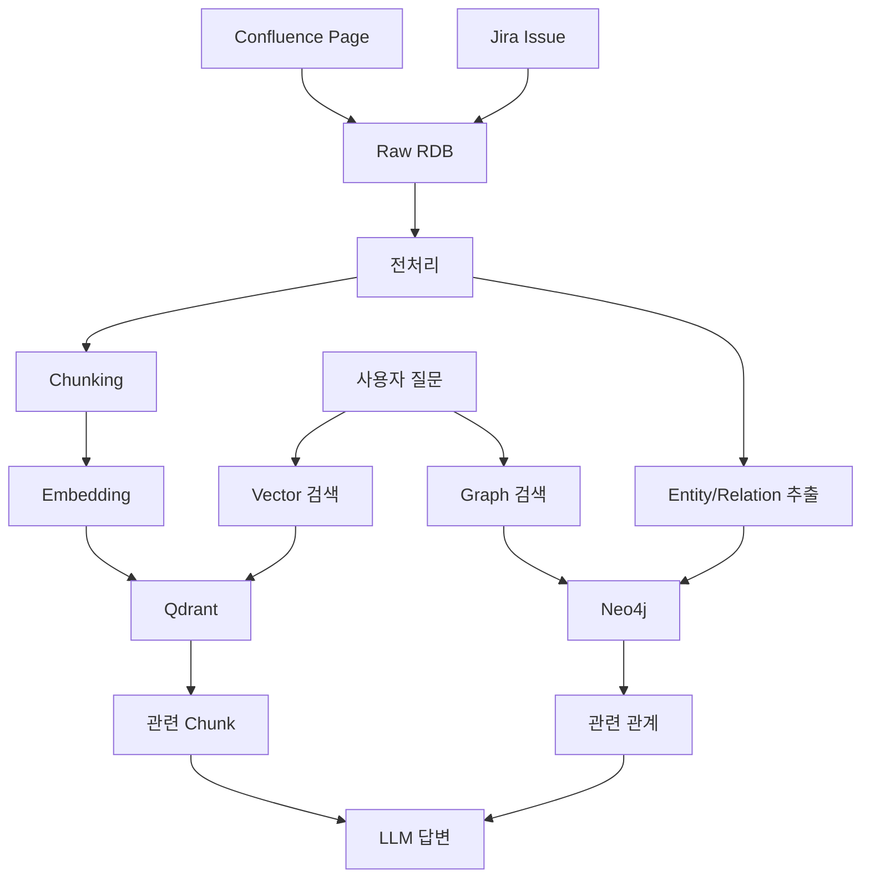

# Confluence 및 Jira 기반 지식 자산화 보고서

> **대상 시스템**: Confluence Cloud, Jira Cloud  
> **목표**: SR 플랫폼에서 활용 가능한 기업 지식 자산화 기준 수립  
> **데이터 범위**: Confluence 문서, Jira 이슈, 운영 문서, 장애 이력  
> **비공개 산출물**: 실제 후보 페이지 목록은 `private_reports/`에 저장  
> **결론**: Confluence는 문서화된 운영 지식, Jira는 실제 처리 이력을 제공하므로 두 데이터를 함께 연결해야 Knowledge Graph 품질이 높아진다.

---

## 1. API 조사 요약

| 구분 | API | 목적 | 활용 |
| --- | --- | --- | --- |
| Confluence Search | `GET /wiki/rest/api/content/search` | CQL 기반 페이지 검색 | 수집 대상 page 목록 확보 |
| Confluence Page Detail | `GET /wiki/rest/api/content/{id}` | 본문/버전/space/label 조회 | 원본 문서 저장 |
| Confluence v2 Page | `GET /wiki/api/v2/pages/{id}` | v2 page 조회 | 향후 v2 전환 검토 |
| Jira Issue Search | `GET /rest/api/3/search/jql` | JQL 기반 issue 검색 | 이슈/담당자/상태 수집 |
| Jira JQL Metadata | `GET /rest/api/3/jql/autocompletedata` | JQL 필드 확인 | 검색 조건 자동화 |

공식 문서 기준:

```text
Confluence REST API
https://developer.atlassian.com/cloud/confluence/rest/

Confluence CQL
https://developer.atlassian.com/cloud/confluence/advanced-searching-using-cql/

Jira Issue Search
https://developer.atlassian.com/cloud/jira/platform/rest/v3/api-group-issue-search/

Jira JQL
https://developer.atlassian.com/cloud/jira/platform/rest/v3/api-group-jql/
```

---

## 2. 인증 및 보안

PoC는 Atlassian 계정 이메일과 API Token을 사용한다.

```http
Authorization: Basic base64(email:API_TOKEN)
Accept: application/json
```

| 항목 | 원칙 |
| --- | --- |
| Token 저장 | `.env` 또는 secret manager에만 저장 |
| GitHub | `.env`, token, 실제 내부 후보 리포트는 push 금지 |
| 로그 | Authorization header, token 값 출력 금지 |
| 운영 | 전용 service account와 최소 권한 token 사용 |

실제 워크스페이스 후보 목록은 공개 문서가 아니라 `private_reports/`에 저장한다.

---

## 3. Confluence 지식 자산화 선정 기준

Confluence의 모든 페이지를 지식 자산화 대상으로 넣으면 검색 품질이 떨어진다.

따라서 “넣을 문서”와 “넣지 않을 문서”를 구분해야 한다.

### 3-1. 자산화에 넣을 기준

| 기준 | 왜 넣는가 |
| --- | --- |
| 장애 증상/원인/조치가 있는 문서 | 같은 장애가 재발했을 때 원인과 조치를 바로 재사용할 수 있다. |
| 설치/운영 절차서 | 반복 작업을 자동 답변이나 체크리스트로 전환할 수 있다. |
| 설정 파일, 명령어, 코드 블록이 있는 문서 | 실제 조치에 필요한 실행 단위 지식으로 활용할 수 있다. |
| 시스템/컴포넌트 관계가 드러나는 문서 | Knowledge Graph에서 영향도와 의존 관계를 만들 수 있다. |
| API 명세나 이벤트 스펙 | SR 문의와 개발/운영 이슈를 구조적으로 연결할 수 있다. |
| Known Issue 문서 | 증상-원인-조치 구조가 명확해 RAG 품질 검증에 적합하다. |
| 버전별 변경/업그레이드 절차 | 특정 버전 장애나 전환 작업에 대한 근거 답변으로 활용할 수 있다. |

### 3-2. 자산화에 넣지 못하는 기준

| 기준 | 왜 넣지 못하는가 |
| --- | --- |
| 회의록 | 결정 맥락은 있지만 재사용 가능한 기술 지식으로 구조화하기 어렵다. |
| 주간보고/일일보고 | 개인 업무 기록 성격이 강해 일반 질의응답 근거로 쓰기 어렵다. |
| 공지성 문서 | 시점성 정보가 많아 시간이 지나면 답변 근거로 부적합할 수 있다. |
| 개인 메모 | 작성자 개인 맥락이 많아 조직 공통 지식으로 보기 어렵다. |
| 본문이 너무 짧은 문서 | 독립적인 chunk나 Entity를 만들 정보량이 부족하다. |
| 링크만 모은 문서 | 실제 지식은 링크 밖에 있어 검색/답변 근거가 약하다. |
| 중복 문서 | 같은 지식이 여러 번 검색되어 답변 품질을 떨어뜨릴 수 있다. |
| 오래된 버전 문서 | 현재 운영 상태와 맞지 않으면 잘못된 조치를 유도할 수 있다. |

---

## 4. 평가 점수 체계

| 평가 항목 | 설명 | 자산화 영향 |
| --- | --- | --- |
| 본문 길이 | 너무 짧거나 너무 긴지 확인 | chunk 품질에 영향 |
| 섹션 구조 | 제목/문단/번호 구조 확인 | section chunking 가능 여부 |
| 기술 키워드 | 장애, 조치, 설정, 로그, 배포 등 | 운영 지식 여부 |
| 관계 표현 | 원인, 기반, 참조, 연결, 의존 등 | Graph Edge 추출 가능 여부 |
| 코드/명령어 | code block, shell, yaml 등 | 실무 조치 활용 가능 |
| Metadata | label, ancestor, version 등 | 출처/분류/증분 처리 가능 |
| 제외 키워드 | 회의록, 개인, 공지 등 | 초기 대상 제외 여부 |

등급:

```text
high
즉시 자산화 후보. Vector RAG와 Graph RAG 모두에 적합.

medium
자산화 가능하지만 전처리나 사람 검토가 필요.

low
초기 자산화 대상 제외 또는 후순위.
```

---

## 5. 실제 워크스페이스 1차 점검 결과

실제 후보 페이지 제목과 URL은 내부 정보이므로 `private_reports/`에만 저장했다.

| 항목 | 결과 |
| --- | --- |
| 검사 대상 | 접근 권한이 있는 Confluence space |
| 검사 페이지 | 25개 |
| high | 9개 |
| medium | 11개 |
| low | 5개 |
| Jira 인증 | 성공 |
| Jira 샘플 이슈 검색 | 성공 |

비공개 산출물:

```text
private_reports/atlassian_asset_candidates.md
private_reports/atlassian_asset_candidates.json
private_reports/atlassian_knowledge_graph_implementation_plan.md
```

---

## 6. 수집 데이터 설계

### 6-1. Confluence 수집 필드

| 필드 | 목적 |
| --- | --- |
| page_id | 원본 식별자 |
| title | 문서 제목 |
| space_key | 권한/분류 기준 |
| version | 증분 동기화 기준 |
| updated_at | 최신성 판단 |
| url | 답변 출처 |
| ancestors | 문서 트리 구조 |
| labels | 분류 metadata |
| body.storage | 원본 HTML |
| plain_text | chunking 입력 |

### 6-2. Jira 수집 필드

| 필드 | 목적 |
| --- | --- |
| issue_key | 원본 식별자 |
| summary | 이슈 제목 |
| description | 본문 |
| status | 처리 상태 |
| issue_type | 요청/장애/작업 구분 |
| project | 프로젝트 분류 |
| components | 시스템/컴포넌트 연결 |
| labels | 키워드 분류 |
| assignee | 담당자 추천 근거 |
| updated_at | 증분 동기화 기준 |
| comments | 처리 맥락 |

---

## 7. Knowledge Graph 연계 아키텍처



---

## 8. Neo4j 모델 초안

### 8-1. Node

```text
Page
Issue
System
Component
Error
Cause
Action
Command
Version
Environment
Person
Team
```

### 8-2. Relationship

```text
(:Page)-[:DOCUMENTS]->(:Component)
(:Page)-[:EXPLAINS]->(:Cause)
(:Page)-[:RECOMMENDS]->(:Action)
(:Issue)-[:MENTIONS]->(:Component)
(:Issue)-[:CAUSED_BY]->(:Cause)
(:Issue)-[:RESOLVED_BY]->(:Action)
(:Person)-[:HANDLED]->(:Issue)
(:Team)-[:OWNS]->(:Component)
(:Component)-[:DEPENDS_ON]->(:Component)
```

---

## 9. 구현안

| 단계 | 작업 | 결과 |
| --- | --- | --- |
| 1 | Confluence high 후보 선정 | 자산화 우선순위 확보 |
| 2 | 원본 RDB 저장 | 재처리/증분 동기화 가능 |
| 3 | section 기반 chunking | Vector 검색 품질 확보 |
| 4 | Qdrant 저장 | 문서 유사도 검색 가능 |
| 5 | Entity/Relation 추출 | Graph 후보 생성 |
| 6 | NetworkX 검증 | 잘못된 관계 사전 확인 |
| 7 | Neo4j 적재 | 운영형 Graph 검색 |
| 8 | Vector + Graph 결합 | 근거 기반 답변/추천 |

---

## 10. 운영 고려사항

| 항목 | 내용 |
| --- | --- |
| 권한 | 사용자 접근 권한에 따라 Vector/Graph 검색 결과 필터링 |
| 중복 | page_id, title, content hash 기준 중복 제거 |
| 최신성 | version, updated_at 기준 증분 처리 |
| 출처 | 모든 답변에 page URL, issue key, section 표시 |
| 보안 | 내부 후보 리포트와 token은 공개 repo 제외 |
| 평가 | high 후보부터 수동 검수 후 자동화 범위 확장 |

---

## 11. 결론

Confluence는 운영 지식의 원천이고 Jira는 실제 처리 이력의 원천이다.

지식 자산화에 넣을 문서는 “반복적으로 재사용 가능한 기술 지식인가”를 기준으로 선정해야 한다.

넣지 못하는 문서는 “조직 공통 답변 근거로 쓰기 어렵거나, 오래되었거나, 정보량이 부족한가”를 기준으로 제외해야 한다.

최종적으로는 Confluence와 Jira를 RDB에 원본 저장하고, Qdrant와 Neo4j에 각각 의미 검색과 관계 탐색 구조로 적재하는 방식이 적합하다.
