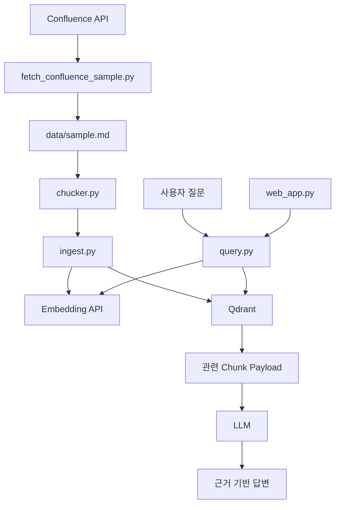
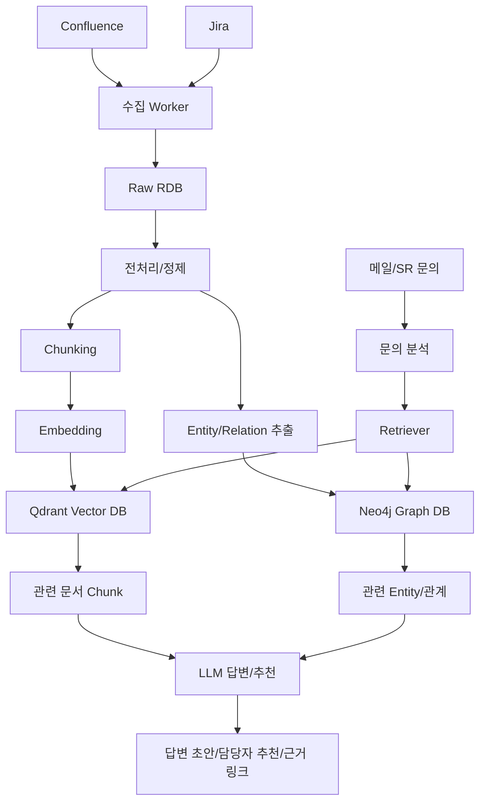

# RAG 구현 및 활용 아키텍처 보고서

> **목표 시스템**: SR 지식 기반 질의응답 PoC  
> **구현 언어**: Python  
> **Vector DB**: Qdrant  
> **Graph PoC**: NetworkX  
> **향후 Graph DB**: Neo4j  
> **결론**: 현재 PoC는 Vector RAG, LangChain RAG, Graph RAG 튜토리얼까지 검증했으며, 다음 단계는 Confluence/Jira 원본 수집과 Neo4j 연동이다.

---

## 1. 구현 현황 요약

| 구분 | 파일 | 상태 | 목적 |
| --- | --- | --- | --- |
| Confluence 수집 | `vector/fetch_confluence_sample.py` | 완료 | Confluence page 본문 수집 → `data/private/sample.md` |
| Chunking | `vector/chucker.py` | 완료 | 섹션/마크다운 헤더 기반 chunk 생성 (커스텀) |
| Vector 저장 | `vector/ingest.py` | 완료 | LangChain(QdrantVectorStore)로 chunk embedding 저장 |
| Vector 질의 | `vector/query.py` | 완료 | LangChain retriever + LCEL 체인으로 검색/답변 |
| Vector Web UI | `vector/web_app.py` | 완료 | 브라우저 기반 질문 화면 |
| Graph 추출 | `graph/documents.py` | 완료 | LLM으로 문서에서 Entity/Relation 추출 |
| Graph 저장 | `graph/ingest.py` | 완료 | Neo4j에 노드/관계 + 노드 임베딩 저장 |
| Graph 질의 | `graph/query.py` | 완료 | LLM 엔티티 추출 + 임베딩 매칭 → 관계 탐색 답변 |
| Graph Web UI | `graph/web_app.py` | 완료 | 브라우저 기반 질문 화면 |
| Graph 튜토리얼 | `tutorial/graph.py`, `graph2.py` | 참고 | 초기 개념 학습(현 `graph/` 패키지의 원형) |

> Vector 트랙은 임베딩·벡터스토어·retriever·생성(LCEL)만 LangChain을 쓰고, 문서 로딩·청킹은 커스텀(`vector/chucker.py`)이다. Graph 트랙은 LangChain 없이 raw SDK(`neo4j`, `google-genai`)로 직접 구현했다.

---

## 2. 현재 PoC 아키텍처



현재 구조는 단일 Confluence 페이지를 수집해 Qdrant에 저장하고, 질문 시 관련 chunk를 검색해 LLM 답변을 생성한다.

---

## 3. Vector RAG 직접 구현

### 3-1. 데이터 흐름

```text
Confluence Page
→ HTML 본문 조회
→ plain text 변환
→ Markdown sample 저장
→ section chunking
→ embedding
→ Qdrant point 저장
→ 질문 embedding
→ Qdrant 유사도 검색
→ LLM 답변
```

### 3-2. Qdrant 저장 구조

| 항목 | 설명 |
| --- | --- |
| Collection | RDB의 table에 가까운 저장 단위 |
| Point | RDB의 row에 가까운 저장 단위 |
| Vector | 유사도 검색에 쓰는 숫자 배열 |
| Payload | LLM 답변에 사용할 사람이 읽는 데이터 |

Payload 예시:

```json
{
  "section": "3. 원인 분석",
  "text": "Dashboard Query에서 사용하는 Label이 존재하지 않아...",
  "source_file": "data/sample.md",
  "chunk_index": 3
}
```

### 3-3. 직접 구현의 장단점

| 장점 | 단점 |
| --- | --- |
| 내부 동작을 이해하기 쉽다 | 기능이 늘수록 코드가 길어진다 |
| Qdrant, Embedding, Prompt 흐름이 명확하다 | Retriever, Chain, Loader 패턴을 직접 관리해야 한다 |
| 학습용 PoC에 적합하다 | 운영형 확장에는 표준 프레임워크가 유리할 수 있다 |

---

## 4. LangChain 기반 구현

LangChain 버전은 직접 구현한 흐름을 표준 컴포넌트로 바꾼 것이다.

| 직접 구현 | LangChain 컴포넌트 |
| --- | --- |
| chunk dict | `Document` |
| 직접 embedding 호출 | `GoogleGenerativeAIEmbeddings` |
| 직접 QdrantClient 사용 | `QdrantVectorStore` |
| 직접 검색 함수 | `Retriever` |
| 직접 prompt 문자열 | `ChatPromptTemplate` |
| 직접 LLM 호출 | `Prompt | LLM | OutputParser` |

LangChain은 RAG를 대신 만들어주는 도구라기보다, RAG에 필요한 단계를 모듈화해주는 프레임워크다.

---

## 5. Graph RAG 튜토리얼

### 5-1. `graph.py`

`graph.py`는 사람이 직접 Node와 Edge를 연결한다.

```text
회원 탈퇴 → 제12조
제12조 → 개인정보보호법 제21조
```

목적은 그래프 탐색의 기본 구조를 이해하는 것이다.

### 5-2. `graph2.py`

`graph2.py`는 문서를 LLM에게 읽혀 Entity와 Relation을 추출한다.

```text
Pod는 Kubernetes의 최소 배포 단위이다.
Deployment는 Pod를 관리할 수 있다.
Service-JS는 Pod를 외부 통신 가능하도록 열어준다.
```

추출 그래프:

```text
Deployment --[manages]--> Pod
Service-JS --[exposes]--> Pod
```

질문:

```text
Deployment를 외부 통신하려면 어떻게 해야해?
```

답변:

```text
Deployment는 Pod를 관리하고, Service-JS는 Pod를 외부 통신 가능하도록 열어준다.
즉 Deployment를 외부 통신하려면 Service-JS를 연결해야 한다.
```

---

## 6. 목표 아키텍처



---

## 7. 저장소 역할

| 저장소 | 역할 | 저장 데이터 |
| --- | --- | --- |
| RDB | 원본 기준점 | Confluence page, Jira issue, version, updated_at |
| Qdrant | 의미 검색 | chunk vector, text payload, source metadata |
| Neo4j | 관계 탐색 | Entity node, relation edge |
| Object Storage | 첨부 보관 | 이미지, 로그 파일, PDF, 스크립트 |

RDB는 재처리와 증분 동기화를 위해 필요하다.

Qdrant는 질문과 비슷한 문서를 찾기 위해 필요하다.

Neo4j는 시스템, 원인, 조치, 담당자 관계를 탐색하기 위해 필요하다.

---

## 8. SR 플랫폼 활용 방안

| 활용 시나리오 | Vector RAG 역할 | Graph RAG 역할 |
| --- | --- | --- |
| 고객 문의 사전 답변 | 유사 문서 검색 | 관련 시스템/조치 관계 탐색 |
| 티켓 담당자 추천 | 유사 과거 티켓 검색 | 담당자-컴포넌트-이슈 관계 탐색 |
| 장애 원인 분석 | 장애 문서 검색 | 원인-증상-조치 경로 탐색 |
| 문서 품질 개선 | 검색되지 않는 문서 발견 | 관계가 끊긴 지식 발견 |

---

## 9. 구현 로드맵

| 단계 | 작업 | 산출물 |
| --- | --- | --- |
| 1단계 | 현재 Vector RAG PoC 정리 | Qdrant 기반 질의응답 |
| 2단계 | LangChain 버전 비교 | LangChain ingest/query |
| 3단계 | Graph RAG 튜토리얼 확장 | Entity/Relation 추출 |
| 4단계 | Confluence 후보 문서 선정 | 지식 자산화 후보 리포트 |
| 5단계 | Raw RDB 설계 | page/issue 원본 저장 |
| 6단계 | Neo4j 연결 | Node/Edge 저장 |
| 7단계 | Hybrid Retriever 구현 | Vector + Graph 검색 |
| 8단계 | SR 연계 | 답변 초안/담당자 추천 |

---

## 10. 운영 고려사항

| 항목 | 고려사항 |
| --- | --- |
| 권한 | 사용자가 볼 수 없는 문서는 검색 결과에서 제외 |
| 출처 | 답변마다 page URL, section, issue key 표시 |
| 증분 | page version, issue updated_at 기준 재처리 |
| 평가 | 검색 정확도, 답변 근거성, 담당자 추천 정확도 측정 |
| 보안 | API token, 고객사 정보, 내부 URL 공개 방지 |

---

## 11. 결론

현재 PoC는 Vector RAG의 기본 동작과 Graph RAG의 핵심 개념을 검증했다.

다음 단계는 실제 Confluence/Jira 데이터를 안정적으로 수집하고, 원본 RDB, Qdrant, Neo4j를 함께 쓰는 구조로 확장하는 것이다.

이 구조가 완성되면 SR 플랫폼은 단순 문서 검색을 넘어, 문의 분석, 담당자 추천, 장애 원인 추적, 조치 추천까지 확장할 수 있다.
