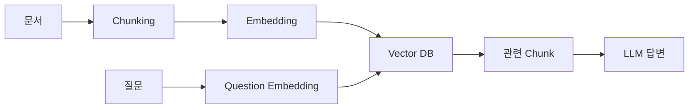

# RAG 및 Knowledge Graph 개념 보고서

> **목표**: SR 플랫폼의 지식 기반 질의응답 구조 이해  
> **범위**: Vector RAG, Graph RAG, Knowledge Graph, 기업 지식 자산화  
> **활용 대상**: Confluence, Jira, 장애 이력, 운영 문서, 고객 문의  
> **결론**: Vector RAG는 유사 문서 검색에 강하고, Graph RAG는 관계 기반 추론에 강하다. SR 플랫폼에서는 두 방식을 결합하는 구조가 가장 현실적이다.

---

## 1. 개요

| 항목 | 설명 | SR 플랫폼 관점 |
| --- | --- | --- |
| RAG | LLM 답변 전에 외부 지식을 검색해 context로 넣는 구조 | 내부 문서 기반 답변 생성 |
| Vector RAG | 문서와 질문을 vector로 바꿔 의미적으로 가까운 문서를 검색 | 유사 장애 문서, 운영 가이드 검색 |
| Graph RAG | 문서에서 Entity와 관계를 추출해 그래프 탐색 | 시스템-원인-조치-담당자 관계 추적 |
| Knowledge Graph | 지식을 Node와 Edge로 구조화한 그래프 | 기업 지식 자산화의 핵심 저장 구조 |

현재 PoC는 Vector RAG를 먼저 구현했고, Graph RAG는 튜토리얼 형태로 개념 검증을 진행했다.

---

## 2. RAG 개념

RAG는 Retrieval-Augmented Generation의 약자다.

LLM이 답변을 생성하기 전에 외부 지식 저장소에서 관련 정보를 먼저 검색하고, 검색된 문서를 근거로 답변하게 만드는 구조다.

### 2-1. 일반 LLM 질의

```text
사용자 질문
→ LLM
→ 답변
```

이 방식은 LLM이 학습한 지식이나 추론에 의존한다.

### 2-2. RAG 질의

```text
사용자 질문
→ 외부 지식 검색
→ 관련 문서 추출
→ 질문 + 관련 문서 전달
→ LLM 답변
```

RAG의 핵심은 LLM이 회사 내부 문서를 외우게 만드는 것이 아니라, 답변 시점에 최신 문서를 검색해서 참고하게 만드는 것이다.

---

## 3. Vector RAG

Vector RAG는 문서와 질문을 embedding model로 vector화한 뒤, Vector DB에서 의미적으로 가까운 문서를 찾는 방식이다.



### 3-1. 핵심 구성요소

| 구성요소 | 의미 | 예시 |
| --- | --- | --- |
| Chunking | 문서를 검색 가능한 단위로 나눔 | `3. 원인 분석`, `5. 조치 내용` |
| Embedding | 문장을 숫자 vector로 변환 | `gemini-embedding-001` |
| Vector | 의미를 표현한 숫자 배열 | `[0.01, -0.24, ...]` |
| Vector DB | vector 유사도 검색 저장소 | Qdrant |
| Payload | 검색 후 LLM에 전달할 실제 본문 | section, text, source_url |

### 3-2. Vector RAG가 잘 맞는 질문

| 질문 유형 | 적합 이유 |
| --- | --- |
| 과거에 비슷한 장애가 있었는가 | 문장 표현이 달라도 유사 문서를 찾을 수 있음 |
| 특정 오류의 원인은 무엇인가 | 원인 분석 section 검색 가능 |
| 조치 방법이 문서에 있는가 | 조치 내용 chunk 검색 가능 |
| 고객 문의와 비슷한 문서가 있는가 | 문의 내용과 문서 의미 비교 가능 |

### 3-3. 한계

Vector RAG는 문서 검색에는 강하지만 Entity 간 관계를 명시적으로 이해하지는 못한다.

예를 들어 `Deployment -> Pod <- Service` 관계를 따라가야 하는 질문은 Graph RAG가 더 적합하다.

---

## 4. Graph RAG

Graph RAG는 문서에서 Entity와 관계를 추출해 Knowledge Graph로 만들고, 질문과 관련된 관계를 탐색해 답변하는 방식이다.

```text
Deployment는 Pod를 관리한다.
Service-JS는 Pod를 외부 통신 가능하도록 열어준다.
```

위 문서는 다음 그래프로 표현할 수 있다.

```text
Deployment --[manages]--> Pod
Service-JS --[exposes]--> Pod
```

사용자가 질문한다.

```text
Deployment를 외부 통신하려면 어떻게 해야해?
```

Graph RAG는 다음 경로를 찾는다.

```text
Deployment → Pod ← Service-JS
```

따라서 답변은 다음처럼 구성된다.

```text
Deployment는 Pod를 관리하고, Service-JS는 Pod를 외부 통신 가능하도록 열어준다.
즉 Deployment를 외부 통신하려면 Service-JS를 연결해야 한다.
```

---

## 5. Knowledge Graph

Knowledge Graph는 기업 지식을 Node와 Edge로 표현한 구조다.

| 요소 | 의미 | 예시 |
| --- | --- | --- |
| Node | 지식의 대상 | Page, Issue, Pod, Loki, 담당자 |
| Edge | 대상 사이의 관계 | manages, caused_by, resolved_by |
| Property | Node/Edge의 부가 정보 | source_url, version, confidence |

### 5-1. 예시 그래프

```text
Loki Dashboard --[requires]--> level Label
Alloy Pipeline --[fails_to_generate]--> level Label
Loki Dashboard Issue --[caused_by]--> Missing Label
Missing Label --[resolved_by]--> Add loki.process
Jira Issue --[mentions]--> Loki Dashboard
Person --[handled]--> Jira Issue
```

### 5-2. 기업 지식 자산화 관점

기업 지식 자산화란 문서, 이슈, 장애 이력, 운영 노하우를 검색과 추론이 가능한 구조로 만드는 것이다.

```text
비정형 문서
→ 원본 저장
→ Chunking
→ Vector DB 저장
→ Entity/Relation 추출
→ Graph DB 저장
→ 질의응답/추천/분석에 활용
```

---

## 6. Vector RAG와 Graph RAG 비교

| 구분 | Vector RAG | Graph RAG |
| --- | --- | --- |
| 핵심 | 의미 유사도 검색 | Entity 관계 탐색 |
| 저장소 | Qdrant 같은 Vector DB | Neo4j 같은 Graph DB |
| 강점 | 비슷한 문서 찾기 | 원인, 조치, 영향, 담당자 관계 추적 |
| 약점 | 관계 추론 약함 | Entity 추출 품질에 영향 받음 |
| 적합한 데이터 | 문서 본문, FAQ, 매뉴얼 | 시스템 구조, 장애 원인, 담당자 이력 |
| SR 활용 | 유사 문의/장애 문서 검색 | 티켓 배정, 원인 경로, 조치 추천 |

결론적으로 SR 플랫폼에서는 두 방식을 함께 써야 한다.

```text
Vector RAG
→ 관련 문서 본문을 찾는다.

Graph RAG
→ 그 문서와 이슈 사이의 관계를 찾는다.
```

---

## 7. SR 플랫폼 활용 시나리오

### 7-1. 고객 문의 사전 답변

```text
고객 메일 수신
→ 문의 내용 분석
→ 유사 문서 검색
→ 관련 장애/조치 관계 탐색
→ 답변 초안 생성
```

### 7-2. 담당자 추천

```text
문의 키워드
→ 관련 컴포넌트 탐색
→ 과거 Jira 이슈 탐색
→ 처리 담당자/팀 추론
→ 담당자 추천
```

### 7-3. 장애 분석 보조

```text
오류 증상
→ 원인 후보
→ 관련 설정
→ 조치 문서
→ 과거 처리 이력
```

---

## 8. 도입 판단

| 판단 항목 | 결론 |
| --- | --- |
| Vector RAG만으로 충분한가 | 단순 문서 검색은 가능하지만 관계 기반 추천은 부족함 |
| Graph RAG가 필요한가 | 담당자 추천, 장애 원인 추적, 시스템 영향 분석에는 필요함 |
| 바로 Graph DB가 필요한가 | PoC는 NetworkX로 가능하지만 운영은 Neo4j가 적합함 |
| 최종 구조 | RDB + Qdrant + Neo4j + LLM 조합 |

---

## 9. 결론

SR 플랫폼의 지식 기반 기능은 단순 챗봇이 아니라 기업 지식 자산화 시스템으로 보는 것이 맞다.

Vector RAG는 문서를 찾는 역할을 맡고, Graph RAG는 지식 사이의 관계를 찾는 역할을 맡는다.

최종적으로는 Confluence와 Jira를 수집해 RDB에 원본을 저장하고, Qdrant에는 문서 chunk를, Neo4j에는 Entity와 관계를 저장하는 구조가 적합하다.
