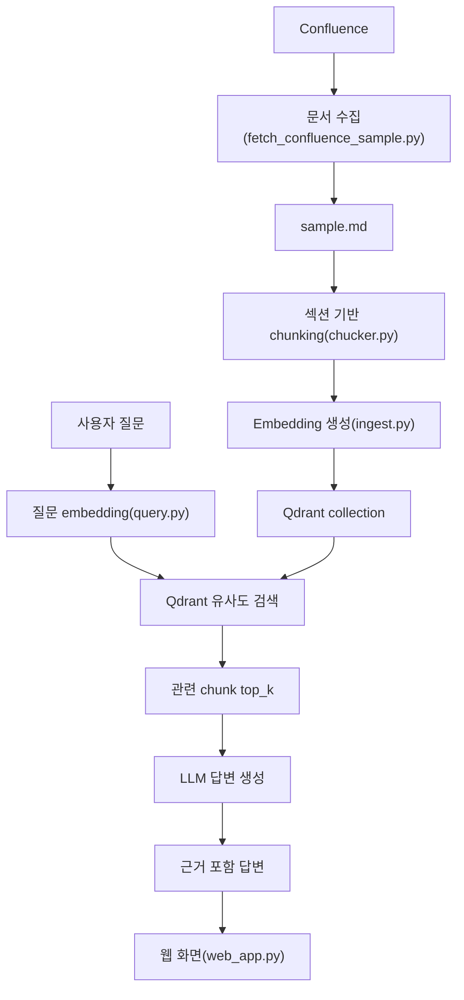
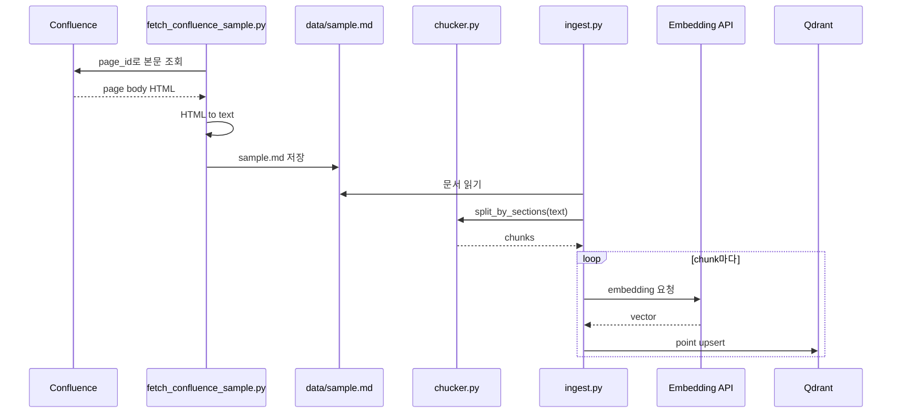
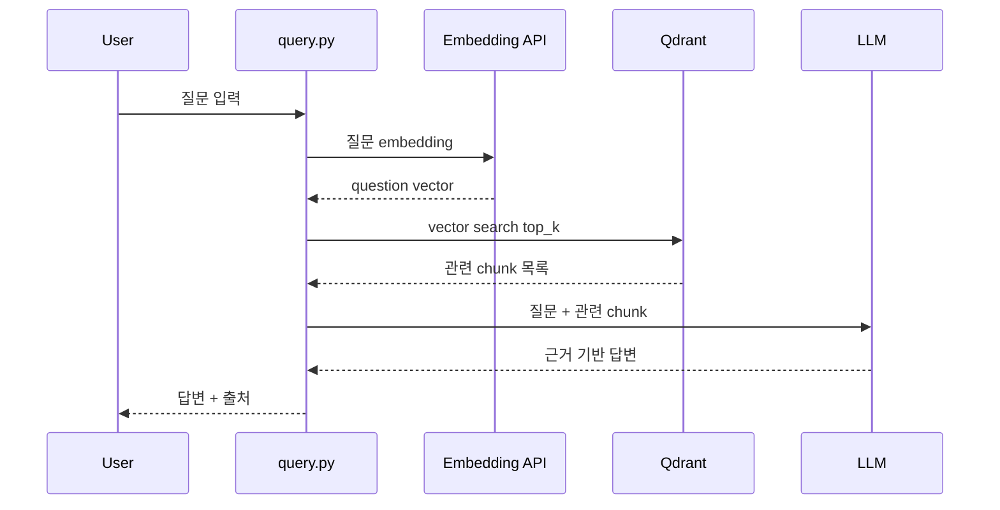

# 전체 구조

## 결론

이 프로젝트의 목표는 Confluence 문서를 가져와 RAG 검색/답변이 가능한 Python PoC를 만드는 것이다.

전체 흐름은 다음과 같다.

```text
Confluence 문서
→ 문서 수집
→ chunking
→ embedding
→ Qdrant 저장
→ 사용자 질문
→ 질문 embedding
→ Qdrant 유사도 검색
→ 관련 chunk 추출
→ LLM 답변 생성
```

현재는 `Confluence 문서 수집 → chunking → embedding → Qdrant 저장 → 질문 검색 → LLM 답변 생성`까지 구현했다.

## PoC 구현 순서

RAG를 구성하려면 먼저 “답변할 지식”을 저장하고 검색할 수 있는 구조가 필요하다.

이 프로젝트에서는 그 저장소로 Qdrant Vector DB를 사용한다. 일반 DB가 row를 조건으로 조회한다면, Vector DB는 질문을 vector로 바꾼 뒤 저장된 문서 vector와 유사도를 비교해서 가까운 point를 찾는다.

전체 구현 순서는 다음과 같다.

```text
1. Qdrant 실행
   RAG에서 검색 대상이 될 vector 저장소를 준비한다.

2. fetch_confluence_sample.py
   Confluence에서 문서 하나를 가져와 data/sample.md에 저장한다.
   꼭 파일로 저장해야 하는 것은 아니지만, PoC에서는 가져온 본문과 정제 결과를 눈으로 확인하기 위해 저장했다.

3. chucker.py
   sample.md를 읽고 문서를 섹션 단위 chunk로 나눈다.
   chunk는 Qdrant에 저장될 검색 단위다.

4. ingest.py
   chunk를 embedding 모델로 vector로 변환한다.
   변환된 vector와 사람이 읽을 payload를 Qdrant collection에 point로 저장한다.

5. query.py 검색 단계
   사용자의 질문을 같은 embedding 모델로 vector로 변환한다.
   Qdrant에 질문 vector를 전달해 유사한 chunk point를 가져온다.

6. query.py 답변 단계
   검색된 chunk의 payload.text를 context로 묶는다.
   Gemini LLM에 질문과 context를 전달해 문서 근거 기반 답변을 생성한다.

7. web_app.py
   FastAPI로 간단한 웹 화면을 제공한다.
   브라우저에서 질문을 입력하면 query.py의 검색/답변 흐름을 호출한다.
```

이 흐름에서 핵심은 두 가지다.

```text
문서 저장 시 embedding 모델 = 질문 검색 시 embedding 모델
검색된 chunk payload = LLM 답변의 근거
```

## 목표 구조



## 컴포넌트 역할

### 1. Confluence 수집

파일:

```text
src/fetch_confluence_sample.py
```

역할:

```text
Confluence REST API 호출
→ 특정 page_id 본문 조회
→ HTML 본문을 텍스트로 변환
→ data/sample.md 저장
```

현재 샘플 페이지:

```text
title: 대시보드 로그 시각화 이슈
page_id: 123456789
space: SPACE
```

향후 확장:

```text
여러 page_id 조회
space 단위 페이지 목록 조회
updated_at/version 기반 증분 수집
삭제/변경 문서 동기화
```

### 2. Chunking

파일:

```text
src/chucker.py
```

역할:

```text
data/sample.md 읽기
→ 번호 섹션 기준으로 문서 분리
→ chunk list 반환
```

현재 chunk 기준:

```text
1. 개요
2. 증상
3. 원인 분석
4. 기존 설정
5. 조치 내용
6. 결과
7. 결론
```

현재는 chunk를 파일로 저장하지 않고, 함수 반환값을 `ingest.py`가 바로 사용한다.

향후 확장:

```text
metadata chunk 제외
source/page_id/title/version을 모든 chunk payload에 포함
너무 긴 section은 하위 chunk로 추가 분할
표/코드 블록 정제
```

### 3. Embedding

파일:

```text
src/ingest.py
```

역할:

```text
chunk text
→ embedding API 호출
→ vector 생성
```

현재 설정:

```text
EMBEDDING_API_MODEL=gemini-embedding-001
```

중요 원칙:

```text
문서 chunk embedding 모델 = 질문 embedding 모델
```

답변 생성 LLM은 embedding 모델과 달라도 된다.

### 4. Qdrant 저장

파일:

```text
src/ingest.py
```

역할:

```text
Qdrant collection 생성
→ chunk vector와 payload upsert
```

현재 collection:

```text
rag_poc_chunks
```

현재 point 구조:

```json
{
  "id": "uuid",
  "vector": [0.01, -0.24, 0.77],
  "payload": {
    "section": "3. 원인 분석",
    "text": "Dashboard Query에서 사용하는 Label이...",
    "source_file": "data/sample.md",
    "chunk_index": 3
  }
}
```

향후 payload 개선:

```json
{
  "title": "대시보드 로그 시각화 이슈",
  "page_id": "123456789",
  "space": "SPACE",
  "section": "3. 원인 분석",
  "text": "...",
  "source_url": "...",
  "version": 9,
  "chunk_index": 3
}
```

### 5. Query 검색

파일:

```text
src/query.py
```

역할:

```text
사용자 질문 입력
→ 질문을 같은 embedding 모델로 vector 변환
→ Qdrant에서 유사 chunk 검색
→ top_k chunk 조회
→ 필요하면 --debug 옵션으로 검색 chunk 출력
```

예상 테스트 질문:

```text
Loki Dashboard에서 로그는 조회되는데 상단 시각화 패널이 0으로 나오는 이유가 뭐야?
```

실제 검색 흐름:

```text
사용자 질문
→ gemini-embedding-001로 질문 vector 생성
→ Qdrant rag_poc_chunks collection 검색
→ score가 높은 point 반환
→ payload의 section/text 사용
```

### 6. LLM 답변 생성

파일:

```text
src/query.py
```

역할:

```text
검색된 chunk
→ 프롬프트 context로 주입
→ LLM이 근거 기반 답변 생성
→ 답변과 참고 section 출력
```

프롬프트 원칙:

```text
제공된 문서 내용만 근거로 답변한다.
문서에 없는 내용은 확인할 수 없다고 답한다.
답변에 참고 section/source를 표시한다.
```

### 7. 웹 화면

파일:

```text
src/web_app.py
```

역할:

```text
FastAPI 웹 서버 실행
→ 질문 입력 form 제공
→ query.py의 search_chunks() 호출
→ query.py의 generate_answer() 호출
→ 답변과 검색된 근거를 화면에 표시
```

실행:

```bash
.venv/bin/uvicorn web_app:app --app-dir src --host 0.0.0.0 --port 8001
```

접속:

```text
http://localhost:8001
```

## 데이터 흐름

### Ingest 흐름



### Query 흐름



## 구현해야 할 작업 목록

### 1단계: 로컬 RAG 저장 파이프라인

상태: 완료

작업:

```text
Qdrant Docker 실행
Confluence 단일 페이지 수집
sample.md 저장
섹션 기반 chunking
Gemini embedding
Qdrant 저장
```

### 2단계: 검색 파이프라인

상태: 완료

작업:

```text
query.py 구현
사용자 질문 입력 받기
질문 embedding 생성
Qdrant top_k 검색
검색된 chunk와 score 출력
```

검증 기준:

```text
질문과 관련 있는 section이 상위 결과로 나오는가
원인 질문에 "3. 원인 분석"이 검색되는가
조치 질문에 "5. 조치 내용"이 검색되는가
결과 질문에 "6. 결과"가 검색되는가
```

### 3단계: LLM 답변 생성

상태: 완료

작업:

```text
검색 chunk를 context로 묶기
LLM API 호출
근거 기반 답변 프롬프트 작성
출처 section 표시
근거 없을 때 답변 거부
```

검증 기준:

```text
문서에 있는 내용은 정확히 답변
문서에 없는 내용은 확인 불가라고 답변
답변에 section/source가 표시됨
```

### 4단계: Confluence 다중 문서 수집

상태: 예정

작업:

```text
space/page tree 조회
여러 page_id 수집
page별 metadata 저장
page_id 기준 chunk upsert
```

검증 기준:

```text
여러 문서가 하나의 collection에 저장됨
질문에 따라 다른 문서의 chunk가 검색됨
source_url로 원문 추적 가능
```

### 5단계: 증분 동기화

상태: 예정

작업:

```text
page_id/version/updated_at 저장
이전 처리 버전과 비교
변경 없는 문서는 skip
변경된 문서만 재수집
기존 chunk 삭제 후 새 chunk upsert
```

검증 기준:

```text
같은 문서를 반복 ingest해도 중복 point가 생기지 않음
문서 version이 바뀌면 chunk가 갱신됨
```

### 6단계: 운영형 가드레일

상태: 예정

작업:

```text
최소 유사도 score 기준 설정
검색 결과 없을 때 답변 거부
고객사/권한별 collection 또는 payload filter
답변 출처 강제
로그 기록
```

검증 기준:

```text
근거 없는 질문에 임의 답변하지 않음
권한 없는 문서를 검색하지 않음
답변 근거가 추적 가능함
```

## 현재 환경 변수

현재는 PyCharm의 `.idea/.env`를 사용한다.

```text
CONFLUENCE_WIKI_URL=https://example.atlassian.net/wiki
CONFLUENCE_USER_EMAIL=...
CONFLUENCE_ACCESS_TOKEN=...
CONFLUENCE_SPACES=SPACE1,SPACE2

EMBEDDING_API_KEY=...
EMBEDDING_API_MODEL=gemini-embedding-001
QDRANT_URL=http://localhost:6333
QDRANT_COLLESPACEION=rag_poc_chunks
```

향후에는 프로젝트 루트 `.env`로 옮기는 것이 더 명확하다.

## 현재 파일 구조

```text
PythonProject/
├── data/
│   └── sample.md
├── docs/
│   ├── 2026.07.07 1일차.md
│   └── 전체 구조.md
├── src/
│   ├── fetch_confluence_sample.py
│   ├── chucker.py
│   ├── ingest.py
│   └── query.py
├── docker-compose.yml
└── qdrant_storage/
```

## 설계 원칙

### 1. 작게 검증한다

처음부터 Confluence 전체를 넣지 않는다.

```text
단일 페이지
→ 여러 페이지
→ 스페이스 단위
→ 증분 동기화
```

순서로 확장한다.

### 2. 검색과 답변을 분리한다

먼저 Qdrant 검색 품질을 확인한다.

그 다음 LLM 답변을 붙인다.

검색이 틀리면 LLM 답변도 틀린다.

### 3. 출처를 항상 남긴다

RAG 답변은 근거 추적이 중요하다.

따라서 모든 chunk payload에는 다음 정보가 있어야 한다.

```text
title
page_id
source_url
section
version
text
```

### 4. embedding 모델을 섞지 않는다

같은 collection에는 같은 embedding 모델로 만든 vector만 저장한다.

문서 embedding과 질문 embedding은 반드시 같은 모델을 사용한다.

```text
문서: gemini-embedding-001
질문: gemini-embedding-001
```

답변 생성 LLM은 달라도 된다.
